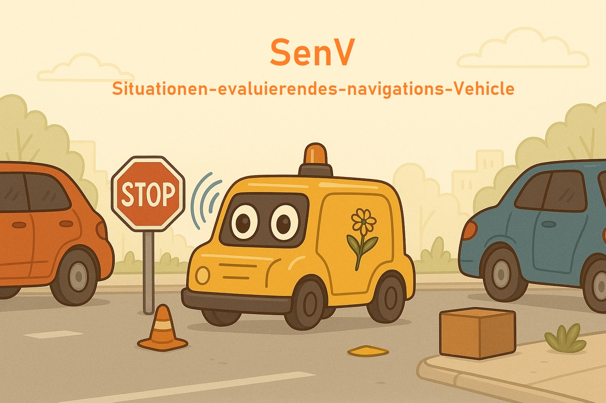

### Weitere Informationen stehen im [Github Wiki](https://github.com/VakuumimKopf/SeNV/wiki)

### Aufgabe 1: Fahrbahn folgen

In dieser Aufgabe wird ein Fahrzeug programmiert, das autonom einer Fahrbahn folgt. Dabei werden folgende Anforderungen umgesetzt:

- **Fahrbahn folgen**: Das Fahrzeug bleibt zwischen zwei durchgehenden weißen Linien.
- **Hinderniserkennung und Anhalten**: Erkennt das Fahrzeug ein Hindernis auf der Strecke (mittels Laserscanner), bleibt es in einem Abstand von 10–20 cm davor stehen.
- **Weiterfahren bei freier Strecke**: Sobald das Hindernis nicht mehr detektiert wird, wird die Fahrt automatisch fortgesetzt.
- **Ignorieren seitlicher Hindernisse**: Hindernisse, die sich neben der Strecke befinden, werden ignoriert.
- **Statusausgabe über Topic**: Der aktuelle Status des Fahrzeugs („fahren“ oder „vor Hindernis warten“) wird über ein ROS-Topic ausgegeben – jedoch nur bei einem Wechsel des Status.

### Aufgabe 2: Rote Ampel erkennen

Aufbauend auf Aufgabe 1 wird in dieser Aufgabe die Funktionalität zur Erkennung und Reaktion auf Ampelsignale implementiert.

- **Rote Ampel erkennen**: Das Fahrzeug ist in der Lage, eine rote Ampel zu erkennen.
- **Anhalten bei roter Ampel**: Bei Erkennung einer roten Ampel hält das Fahrzeug an.
- **Weiterfahren bei grüner Ampel**: Sobald die Ampel auf grün wechselt, setzt das Fahrzeug seine Fahrt automatisch fort.
-  **Statusausgabe über Topic**: Der aktuelle Status des Fahrzeugs („fahren“ oder „vor roten Ampel warten“) wird über ein ROS-Topic ausgegeben – jedoch nur bei einem Wechsel des Status.

### Aufgabe 3: Hinderniss umfahren
- **Hinderniss erkennung**: frontale Hindernisse erkennen und Action starten
- **Hinderniss umfahren**: Fahrbahn wechsel und parallel zum Hinderniss vorbei fahren -> Spurwechsel auf rechte Fahrbahn und Action beenden

### Aufgabe 4: Einparkaufgabe

- **Parkschild erkennen**: Das Fahrzeug erkennt ein Parkschild mittels Yolov8 Models (Objekterkennung) und registriert durch einen Laserscanner, dass es passiert wurde 
- **Parklücken mit/ohne Objekt verifizieren**: Das Fahrzeug fährt an den einzelnen Lücken entlang und misst mittels Laserscanner, ob ein Objekt diese blockiert.
- **Einparken**: Sobald eine Lücke als frei erkannt wurde, setzt das Fahrzeug zurück, dreht sich um 90° und fährt in die Lücke. Anschließend wird auf gleiche Weise ausgeparkt.

### Aufgabe 5: Störungsaufgabe (Code aktuell noch in Code-Cleanup Branch)

- **Störungen ignorieren**: Das Fahrzeug filtert anhand von Linienposition, Liniendicke und Linienkrümmung (Eher Anstieg) Störungen von Fahrlinien
- **Fehlende Linien**: Das Fahrzeug hält seine Fahrt auch, wenn die Fahrlinien fehlen sollten bis es wieder Fahrlinien findet

### Aufgabe 6 : Fußgängerüberweg 

- **Füßgängerüberwegsschild erkennen**: Gleiches Prinzip wie bei der Parkschild-Erkennung. Hier wird die Position des Schildes nicht mittels Laserscanner überprüft, sondern geschaut, ob das Schild noch im Bild der Kamera zu sehen ist.
- **Fußgänger erkennen**: Hierfür wurde ein zweites Yolov8 Model mit Bilder des Fußgängers trainiert.
- **Überqueren des Fußgängerüberweges**: Das Objekterkennungsmodel gibt während der Erkennung die X-Werte des erkannten Menschen aus. Zur ersten Erkennung wird ein Startwert festgelegt und dann während des Wartens die Differenz des akutellen X-Wertes zum Startwert berechnet. Wenn diese einen bestimmten Schwellenwert erreicht, wurde der Fußgängerüberweg erfolgreich überquert. 
